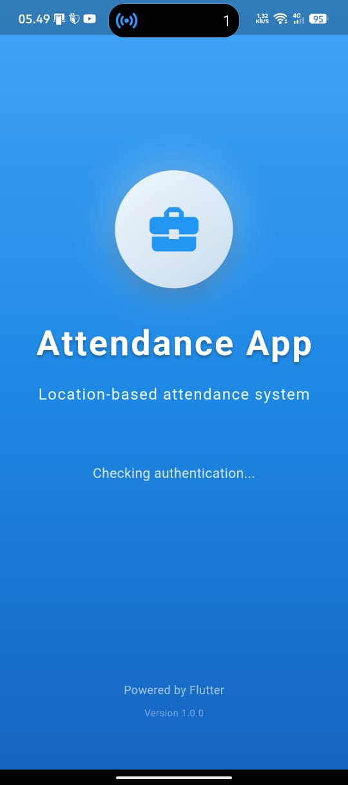
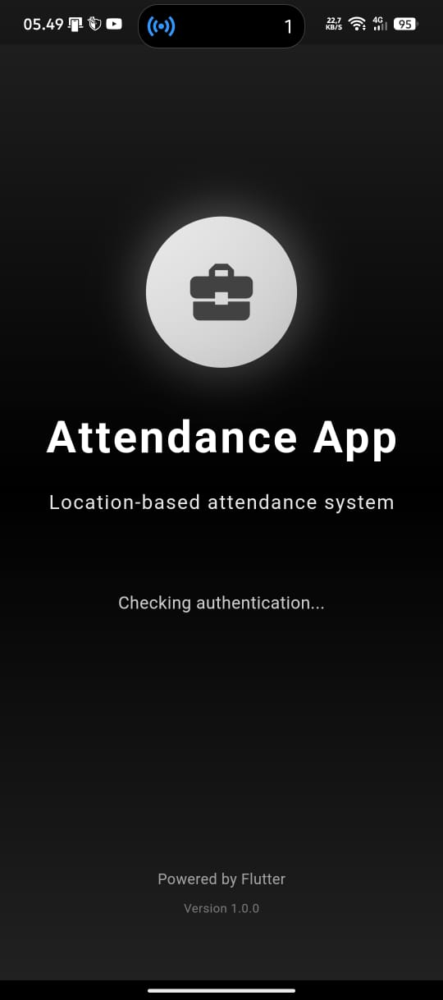
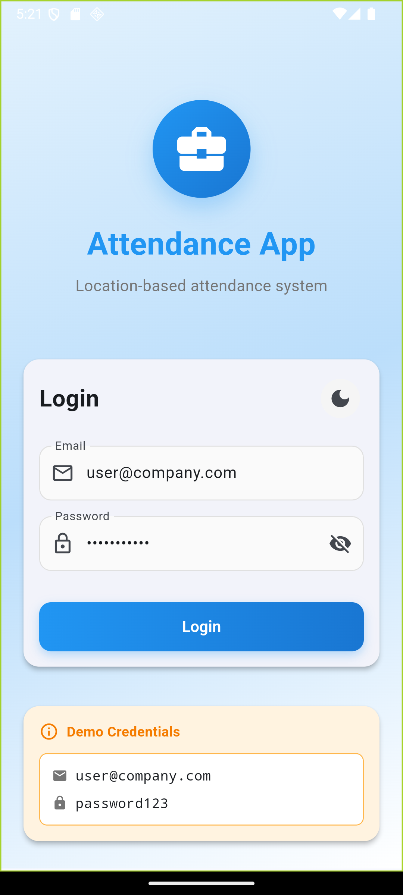
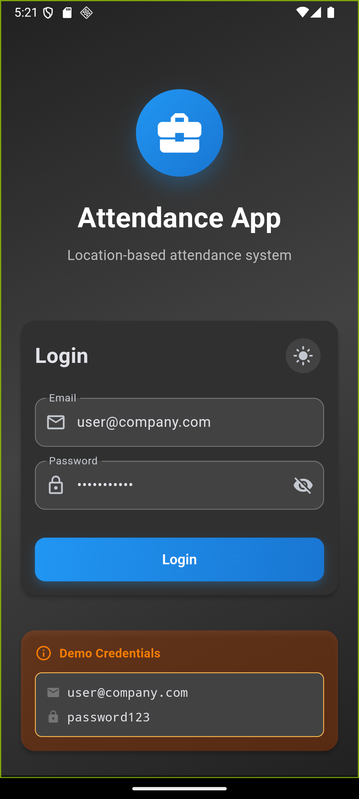
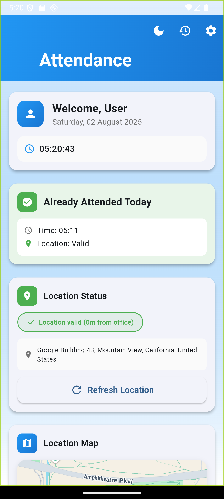
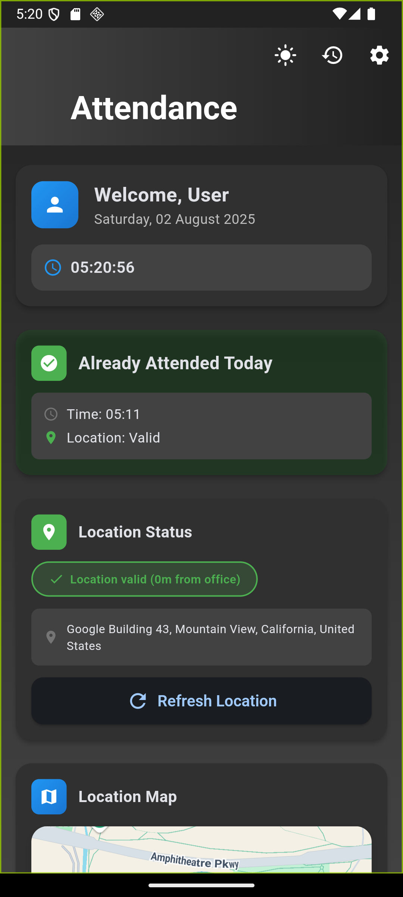
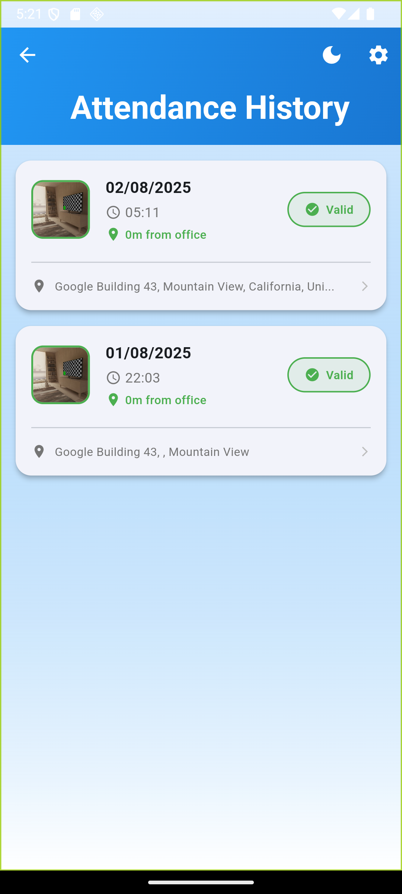
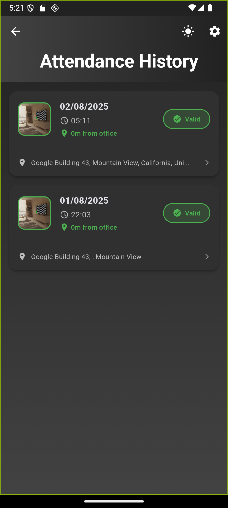
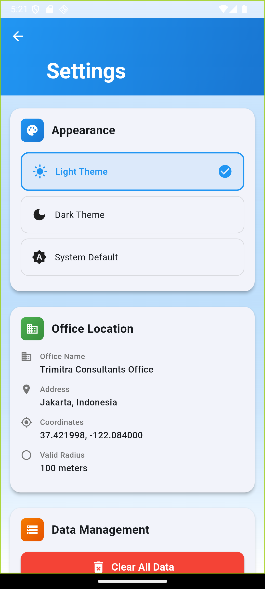
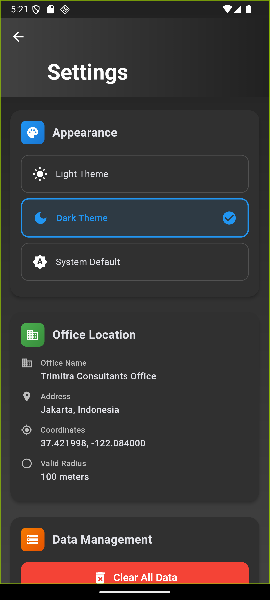

# Attendance App - Technical Documentation

Dokumentasi teknis lengkap untuk Attendance App Flutter dengan sistem absensi berbasis lokasi.

## 🎯 Overview

Attendance App adalah aplikasi Flutter modern yang menggunakan:

- **Provider Pattern** untuk state management
- **Material 3 Design** untuk UI/UX
- **Real-time Location** validation
- **Camera Integration** untuk selfie verification
- **Local Database** dengan Hive

## 📱 Screenshots

### Splash Screen

- Animated logo dengan pulse effects
- Auto-redirect berdasarkan authentication status
- Theme-aware gradient backgrounds

### Login Screen

 

- Modern UI dengan smooth animations
- Dark/Light theme toggle
- Form validation dengan error handling

### Dashboard

 

- Real-time location validation
- Interactive maps dengan radius visualization
- Status indicators dengan Material 3 design

### Attendance History

 

- Provider-based data management
- Interactive cards dengan photo thumbnails
- Pull-to-refresh functionality

### Settings

 

- Theme management
- Office location display
- Data management options

## 🔧 Key Features

### 1. Authentication Flow

- Persistent login state dengan SharedPreferences
- Automatic session validation
- Smooth navigation transitions

### 2. Location Validation

- GPS-based attendance validation
- Configurable office radius (default: 100m)
- Real-time distance calculation menggunakan Haversine formula

### 3. Camera Integration

- Front camera untuk selfie verification
- Image compression dan storage
- Photo validation dengan visual feedback

### 4. Data Management

- Hive database untuk local storage
- Type-safe models dengan code generation
- CRUD operations dengan error handling

## 🤝 Support

Untuk bantuan teknis atau pertanyaan, silakan hubungi:

- **Email**: rendidwi.softwaredev@gmail.com
- **Issues**: [GitHub Issues](https://github.com/trimitra/attendance-app/issues)
